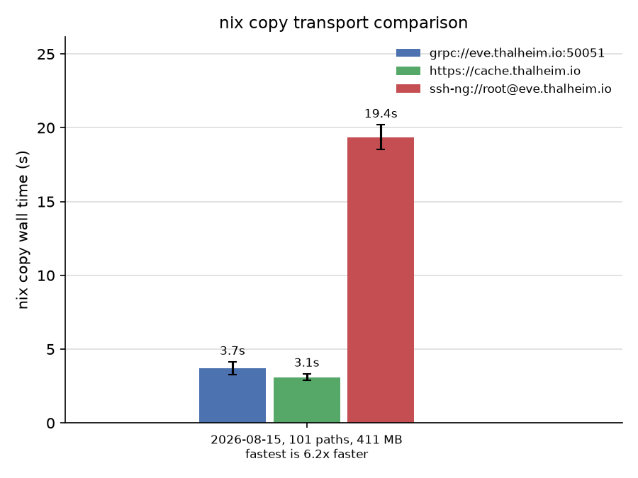
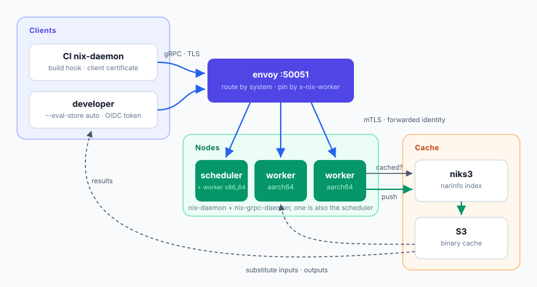
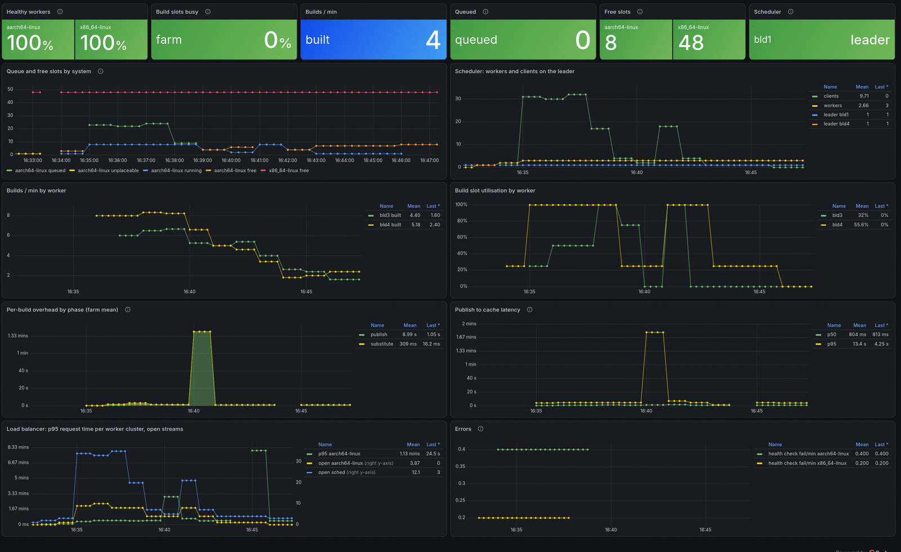

Given the increasing costs for hardware while we have at the same time more
software to build (as generated by our little helpers), it becomes more and more
important to share our build resources.

Nix introduced a remote build mechanism early on, based on the ssh protocol, to
build an ever-increasing nixpkgs. This protocol was designed to work well when
NixOS was built at the Delft University of Technology, where build machines were
all co-located in the same rack just a few centimeters away from each other. As
such it is not surprising that the protocol was not particularly well optimized
to perform under higher network latencies, i.e. over the internet.

To address this, we created a protocol that can be used in Nix as a plugin that
uses the [gRPC](https://grpc.io/) protocol and optimizes the build operations to
perform fast also under WAN latencies by reducing the roundtrip times between a
build client and the builder. The project can be found
[here](https://github.com/Mic92/nix-grpc-store).

The results speak for themselves:



A detailed explanation of why this is better can be read
[here](https://github.com/Mic92/nix-grpc-store/blob/main/docs/latency.md).

Now that we can issue builds fast, we need to have a way to distribute them to
machines that may or may not be online. The old mechanism in Nix to do this was
to add each machine you want to build with into `/etc/nix/machines`.

This example will instruct the local nix-daemon to use the `mac02` machine
whenever there is a build for macOS:

```
nix-shell-env % cat /etc/nix/machines
ssh-ng://customer@mac02.numtide.com aarch64-darwin,x86_64-darwin /run/secrets/ssh-remote-builder 8 1 big-parallel,recursive-nix - -
```

Scaling this to a group becomes a bit cumbersome because now everyone has to
keep this list of machines up-to-date and also each ssh key needs to be deployed
in the list of keys for every builder machine.

To solve this problem we introduce a `Farm mode` in nix-grpc-store:



One builder gets elected to become a build scheduler and every other worker will
connect to this scheduler to receive build jobs. Finished builds will be
uploaded to [niks3](https://github.com/Mic92/niks3/), which is a binary cache
service that can upload to S3 compatible storage such as Garage or SeaweedFS.

To sum up, this allows us to now scale builds in a much better way across
multiple builders without creating network bottlenecks. Machines can now be
temporarily offline or have a full disk and the system will route builds to
healthy machines instead. Here is a little monitoring dashboard that shows our
current build queue.



Happy building!
